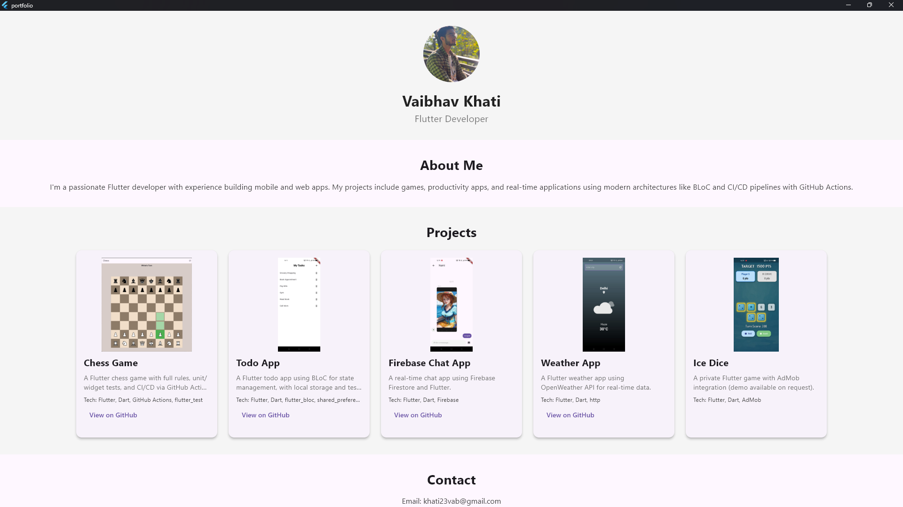

# Flutter Portfolio

A responsive Flutter-based portfolio webpage showcasing my projects as a Flutter developer. The site features a clean UI, dynamic card sizing, and text scaling for optimal display across mobile, tablet, and desktop devices. Built with Flutter for web and deployed on GitHub Pages.

## Features
- **Responsive Design**: Adapts to screen sizes using `MediaQuery` for dynamic card widths (90% on mobile, 300px on desktop), text scaling (0.8x mobile, 1.0x desktop), and image aspect ratios (16:9).
- **Project Showcase**: Displays projects with images, descriptions, technologies, and GitHub links.
- **Interactive UI**: Includes clickable GitHub links, a contact section with email, and a footer.
- **Optimized Performance**: Uses `BoxFit.cover` for images and `TextOverflow.ellipsis` to prevent overflow.
- **Deployment**: Hosted on GitHub Pages at [vaibhav23rd.github.io/portfolio](https://vaibhav23rd.github.io/portfolio).

## Screenshot

## Projects
- **Chess Game**: A feature-rich chess game with unit/widget tests and CI/CD (in progress). [GitHub](https://github.com/Vaibhav23rd/ci-cd_chess_game)
- **Todo App**: A BLoC-based todo app with local storage and automated tests. [GitHub](https://github.com/Vaibhav23rd/bloc_todo_app)
- **Firebase Chat App**: A real-time chat app using Firebase Firestore. [GitHub](https://github.com/Vaibhav23rd/firebase_chat_app)
- **Weather App**: A weather app using OpenWeather API for real-time data. [GitHub](https://github.com/Vaibhav23rd/api_weather_app)
- **Ice Dice**: A private game with AdMob integration (demo available on request).
